# AFIDS Protocol

Preparation
-----------
* Download and use [Slicer 4.10.2](https://download.slicer.org/)
* Download template files  <a href="https://drive.google.com/open?id=12-GtUhNBMlbASZRqK1EQeg7nz1m_7uuz" target="_blank">here</a>

|       file       |    name   |
|------------------|-----------|
|D99.nii.gz        |d99        |
|inia19.nii.gz     |inia19     |
|macaqueMNI.nii.gz |macaqueMNI |
|NMTv1.3.nii.gz    |nmtv1.3    |
|yerkes19.nii.gz   |yerkes19   |

Naming Scheme for Fiducial Files
--------------------------------
* [VolumeID]\_[Contrast]\_[Rater]\_[N] (e.g. macaqueMNI_T1_JL_01)

  * **[VolumeID]** = the identifier for the volume on which you are performing the fiducial placements; for the tutorial it will be a well known macaque MRI templates:
    * Colin27: average of 25 adult macaque monkeys (18 Macaca Fascicularis, 7 Macaca Mulatta)
  * **[Contrast]** = T1
  * **[Rater]** = the unique identifier for the rater performing the fiducial placement; convention will be first initial and last name to prevent overlap
  * **[N]** = reference for fiducial placement session (helpful if performing placements more than once; starting with 1)

AC-PC Placement
---------------
Download assigned volume/template from github repository.
Go to Markups Module and create markups list entitled **ACPC\_[VolumeID]\_[Contrast]\_[Rater]\_[N]**. Place **AC** and **PC** landmarks:
1. AC = anterior commissure (center)
2. PC = posterior commissure (center)

Create new AC-PC transform
--------------------------
Create a new markups list entitled **Fid32\_[VolumeID]\_[Contrast]\_[Rater]\_[N]**.
Create a new markups list entitled **midline**.

To create a new AC-PC Transform you must place AC and PC fiducial markers in previous step. 
1. Copy AC and PC markers from **ACPC** to the **midline** markups list.
2. Go back to the **midline** markups list and place a fiducial marker in the infracollicular sulcus (point 3)
3. Place another fiducial marker at the Genu of CC (point 19)
4. You should now have AC and PC in the **ACPC** markups list and AC, PC, infracollicular sulcus and Genu of CC in the **midline** markups list
5. Under modules select Registration --> Specialized --> ACPC Transform. 
6. In the Transform Panel, under ACPC Line select the **ACPC** markups list, under Midline select the **midline** markups list, and under Output transform select **"Create new linear transform as…"** and name it **Output transform**.
7. Click **apply** at the bottom of the window.
8. **Note: if the volume turns off** --> under modules go to Data. Beside the image volume select the ‘eye’ icon to turn the volume back on.
9. Next under Modules go to Transforms and under Active Transform dropdown tab select the create Output transform (if not already selected). 
10. Under Apply Transform select all 4 items (i.e **macaqueMNI**, **ACPC_macaqueMNI_T1_GG_0l**, **midline**, and **Fid32_macaqueMNI_T1_GG_0l**) and transfer them to the transformed side. 

General Fiducial Placement Strategies
-------------------------------------
Use the **"Jump to Slice"** feature to center your view on the fiducial of interest and ensure that the placed landmark appears accurate 
on all three standard views (axial, sagittal, coronal). Once a fiducial is placed, **dragging** the fiducial can allow for more refined 
placement. Holding down **shift** centers the view in all views on the cursor (use along with crosshair function). If a given fiducial 
is classified as **[midline]**, jump to an existing midline fiducial (e.g. AC or PC) and start by placing the fiducial on the 
**sagittal** view and refine placement using the other views. Try to place fiducials at the **boundary/edge** of the feature of 
interest. For some of the fiducials, the instructions for placement will explicitly say to place the landmark using information mostly 
from one view (e.g. axial view for olfactory sulcus). Be aware that changing the windowing of your images (and lighting in the room) may 
affect your perception of where landmarks should be placed. When you're satisfied with the location of a fiducial, **lock it in place** 
to prevent yourself from displacing it later. **NOTE: there is no UNDO feature for fiducial placements.**

Placement of Fiducial Series
----------------------------
Copy points from the **ACPC** markups list to the **Fid32\_[VolumeID]\_[Contrast]\_[Rater]\_[N]** markups list. Copy over AC and PC to your **Fid32** markups list by right clicking each fiducial, choosing "Copy fiducial to another list", and selecting **Fid32\_[VolumeID]\_[Contrast]\_[Rater]\_[N]**. Place the remaining **30 fiducials**, enter the number corresponding to the fiducial in the **Name** textbox and enter the description in the corresponding **Description** textbox. When placing the fiducials make sure you are on the **Fid32\_[VolumeID]\_[Contrast]\_[Rater]\_[N]** markup list.

To help with monitoring the current location of the pointer, toggle on the **Slice intersection** under **Toggle crosshair visibility**.

----------------------------

### **1. AC [midline]**
  
> **Name:** 1 
> **Description:** AC

* Place at the center of the commissure. 
  
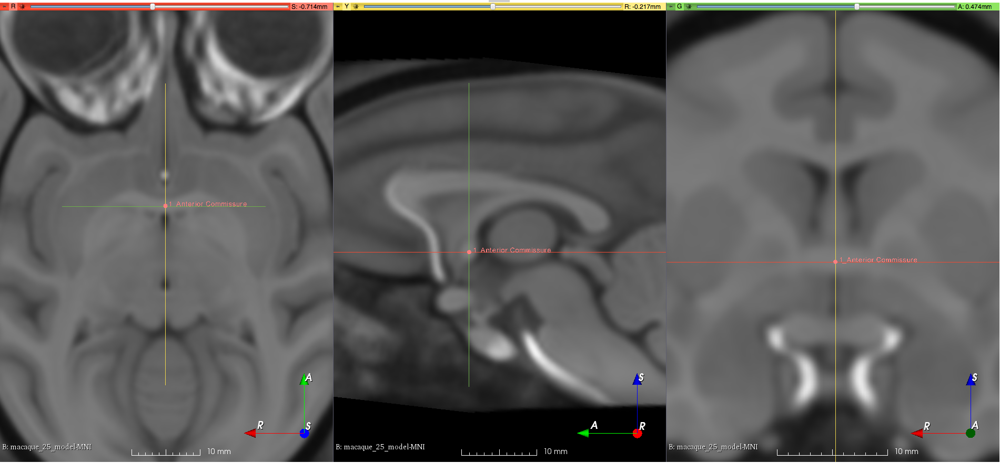

----------------------------

### **2. PC [midline]**

> **Name:** 2 
> **Description:** PC

* Place at the center of the commissure

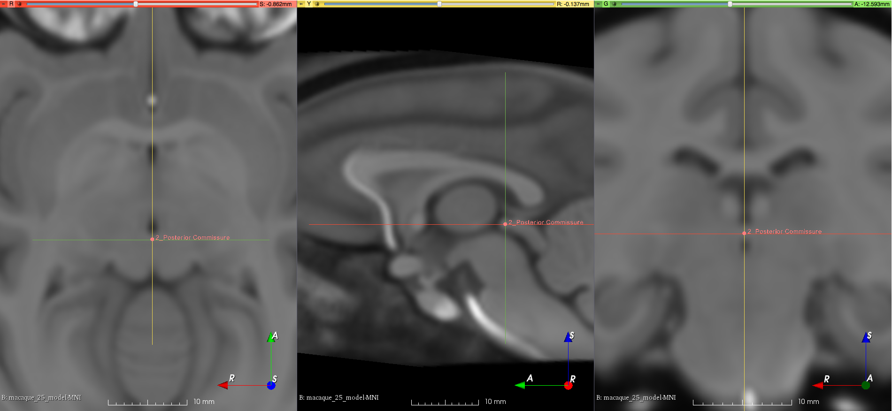

----------------------------

### **3. infracollicular sulcus [midline]**

> **Name:** 3 
> **Description:** infracollicular sulcus
  
* Inferior part of sulcus of inferior colliculi at the midline junction of inferior colliculi
* Inferior most boundary of longitudinal intercollicular sulcus

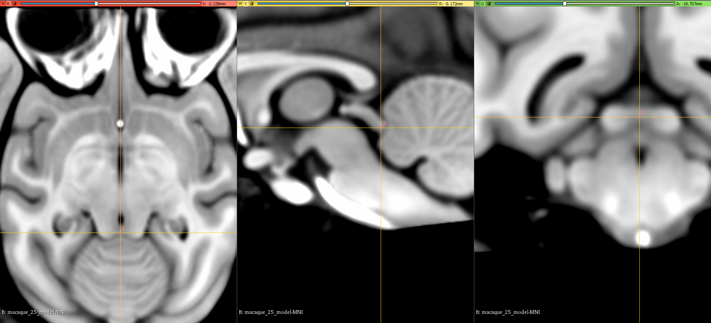

----------------------------

### **4. Pontomesencephalic junction [midline]**

> **Name:** 4 
> **Description:** PMJ

* At the intraventricular junction but because the junction tapers off gradually, choose the ventral/inferior/pontine side of the junction. Using the sagittal view, find the junction at midline, next verify that you are at the junction by checking the axial view.

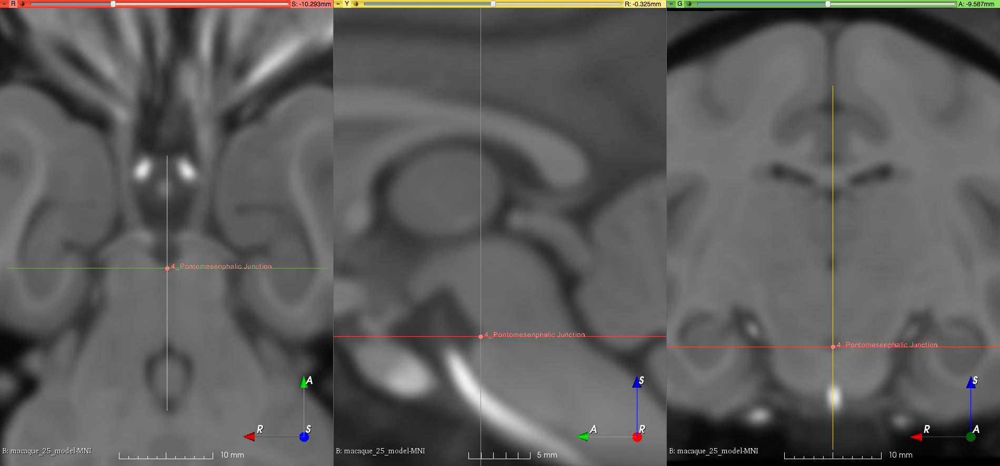

----------------------------

### **5. Superior interpeduncular fossa [midline]**

> **Name:** 5 
> **Description:** superior interpeduncular fossa

* Most superior axial slice showing the interpeduncular fossa
* Use coronal slice to help optimize location at boundary of 3rd ventricle and surrounding brain
* Commentary: useful fiducial location for DBS since subthalamic nucleus close by

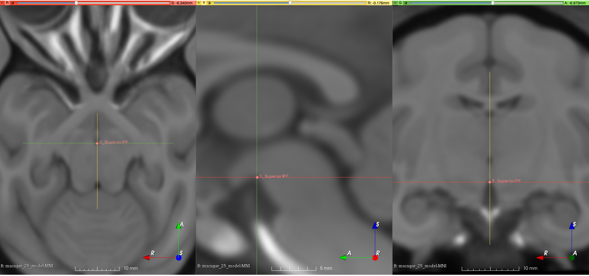

----------------------------

### **6. Right superior lateral mesencephalic sulcus**

> **Name:** 6 
> **Description:** R superior LMS

* Start at sagittal slices at the posterior boundry of PC.
* Localize using axial slices; at boundary of CSF and brain
* Use the coronal and sagittal views to optimize the location so that this point is in the angle created in all views

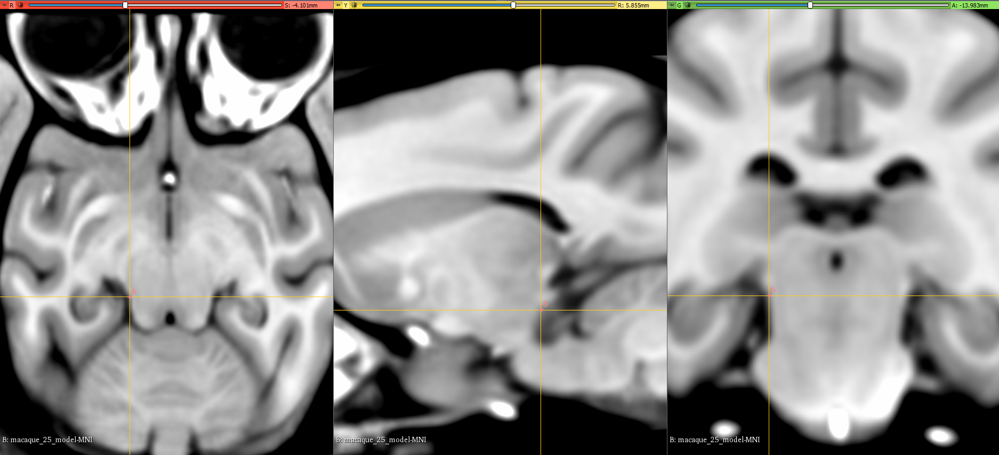

----------------------------

### **7. Left superior lateral mesencephalic sulcus**

> **Name:** 7 
> **Description:** L superior LMS

* As in 6

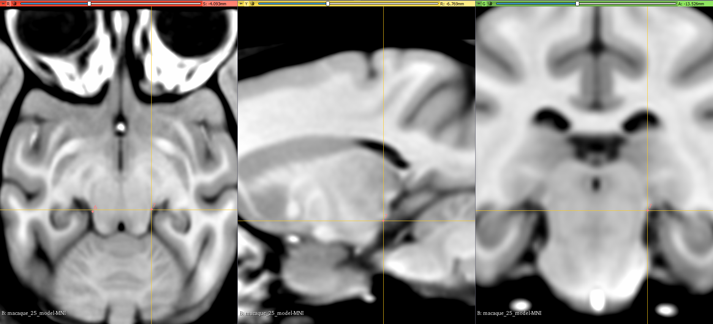

----------------------------

### **8. Right inferior lateral mesencephalic sulcus**

> **Name:** 8 
> **Description:** R inferior LMS

* Start at sagittal slices at the posterior boundry of PC.
* Using axial section, level the slice intersection to the Pontomesencephalic Junction(3rd fiducial)
* Localize at junction between midbrain and pons using axial slices
* Refine positioning using sagittal view (at the change in angle of brainstem at the PMJ)

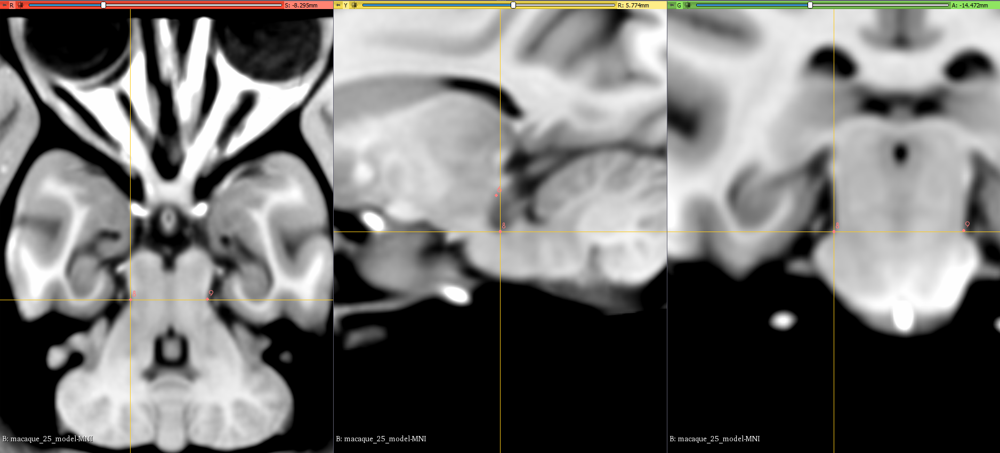

----------------------------

### **9. Left inferior lateral mesencephalic sulcus**

> **Name:** 9 
> **Description:** L inferior LMS

* As in 8

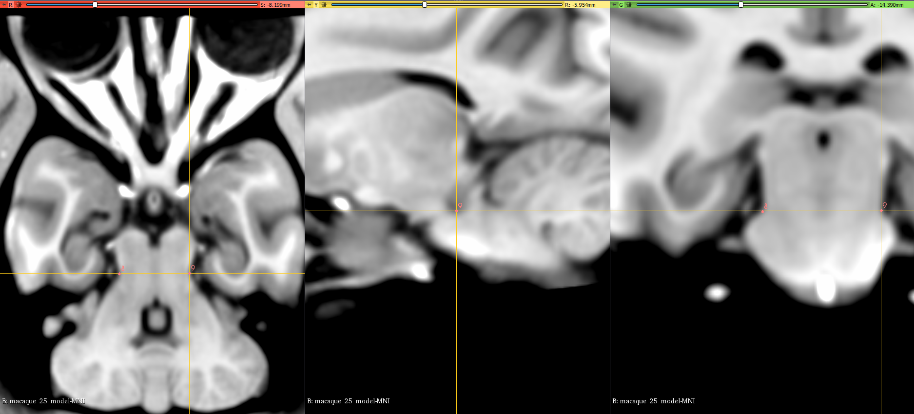

----------------------------

### **10. Culmen [midline]**

> **Name:** 10  
> **Description:** culmen

* Jump to AC or another midline AFID to get to the mid-sagittal slice, then place using the sagittal view
* Most superior point of cerebellar vermis; one of the vermian lobules
* Axial view will allow you to choose the most superior part of the vermis; Scroll through this view while remaining in midline until you reach the apex. 

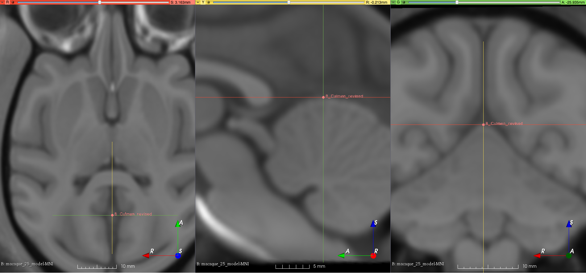

----------------------------

### **11. Intermammillary sulcus [midline]**

> **Name:** 11  
> **Description:** intermammillary sulcus

* Click to jump to AC landmark and place using the sagittal view 
* Using the coronal view get to the midpoint between the mamillary bodies. 
* Remember to place at the border of the grey matter. Refine this using axial view where border is most clear.

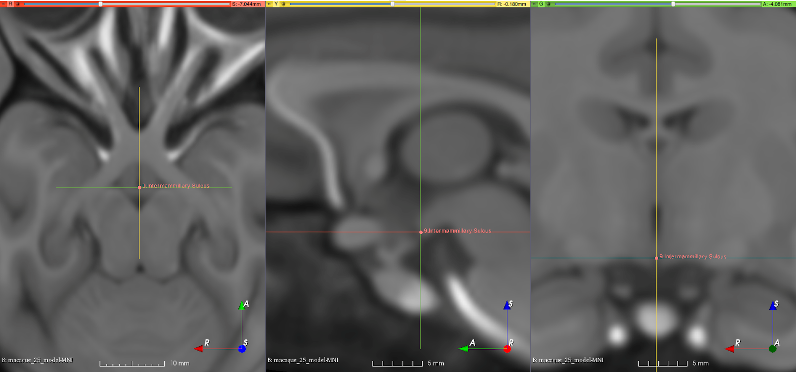

----------------------------

### **12. Right mammillary body**

> **Name:** 12  
> **Description:** R MB

* Place at the center of the mammillary body

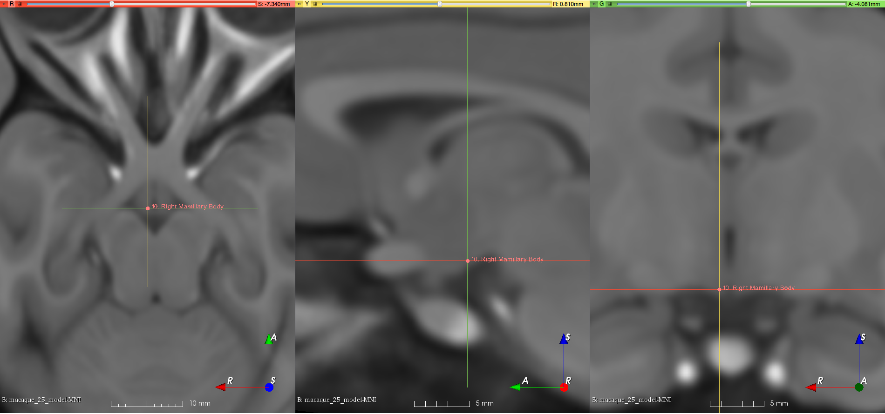

----------------------------

### **13. Left mamillary body**

> **Name:** 13  
> **Description:** L MB

* As in 12

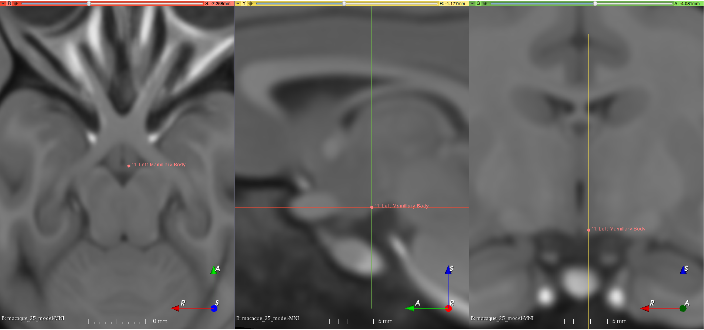

----------------------------

### **14. Pineal gland [midline]**

> **Name:** 14  
> **Description:** pineal gland

* Click to jump to the AC landmark on the sagittal view and localize the most superior border of AC on sagittal view, then proceed to go posterior until past PC.
* Place AFID in the middle of gland (use all views to correctly place this point)
* Occasionally the pineal gland is calcified, which makes it more difficult to find the center of the gland. Be sure to scroll back and forth in all views to find the true center point regardless of asymmetry of calcifications

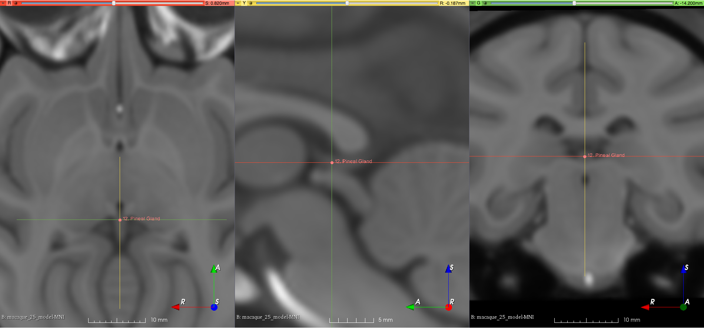

----------------------------

### **15. Right lateral aspect of frontal horn at AC**

> **Name:** 15  
> **Description:** R LV at AC

* Defined at same coronal slice as AC (jump to it)

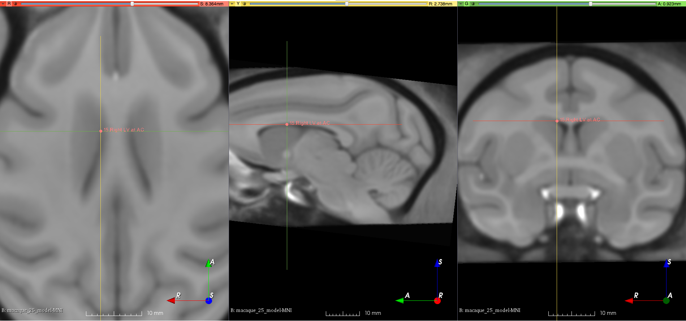

----------------------------

### **16. Left lateral aspect of frontal horn at AC**

> **Name:** 16  
> **Description:** L LV at AC

* As in 15

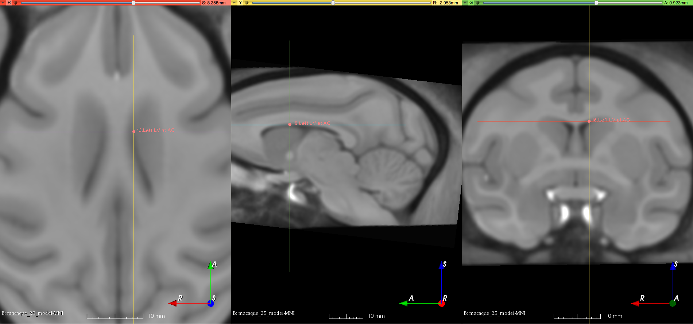

----------------------------

### **17. Right lateral aspect of frontal horn on at PC**

> **Name:** 17  
> **Description:** R LV at PC

* Defined at same coronal slice as PC (jump to it)

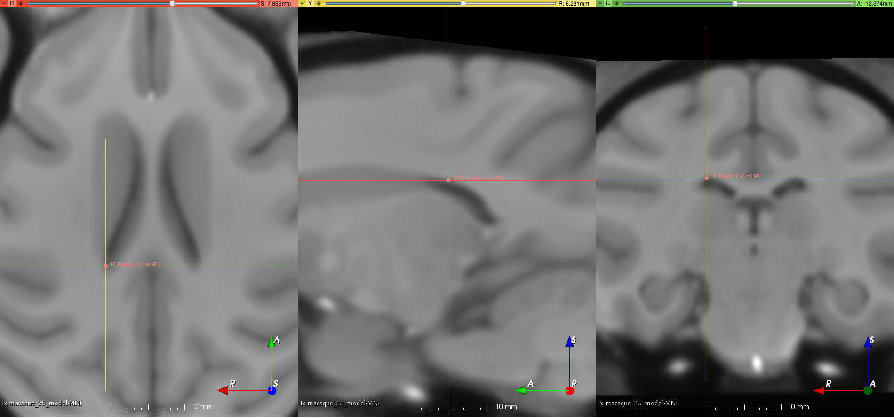

----------------------------

### **18. Left lateral aspect of frontal horn at PC**

> **Name:** 18  
> **Description:** L LV at PC

* As in 17

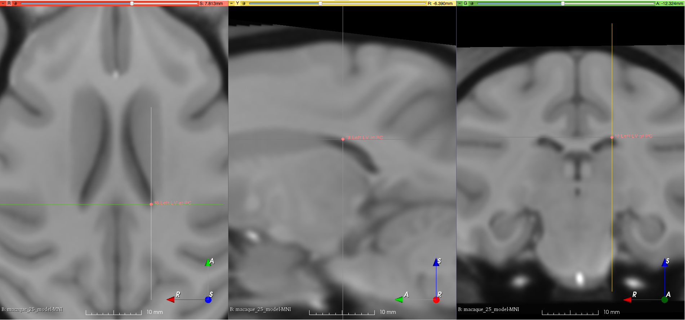

----------------------------

### **19. Genu of corpus callosum [midline]**

> **Name:** 19  
> **Description:** genu of CC

* Jump to AC and place using sagittal view
* Optimize using coronal view as most anterior point of the corpus callosum on coronal slice.
* Midline vasculatures are prominent in this region. Adjusting contrast allows for differentiation between grey matter and vessels. Refine fiducial using axial view. 

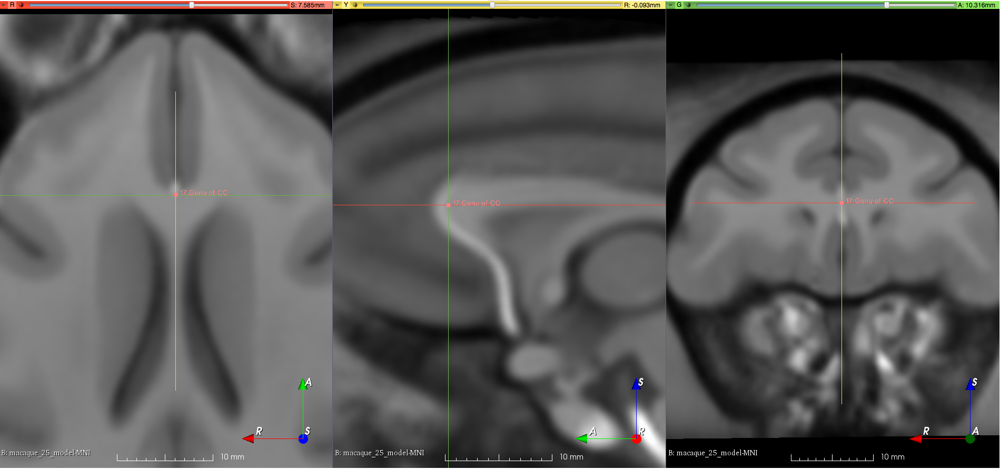

----------------------------

### **20. Splenium of the corpus callosum [midline]**

> **Name:** 20  
> **Description:** splenium of CC

* Jump to AC and place using sagittal view.
* Proceed posterior and optimize point using coronal view as the in inferior-most point on coronal section. Refine the border using axial view.

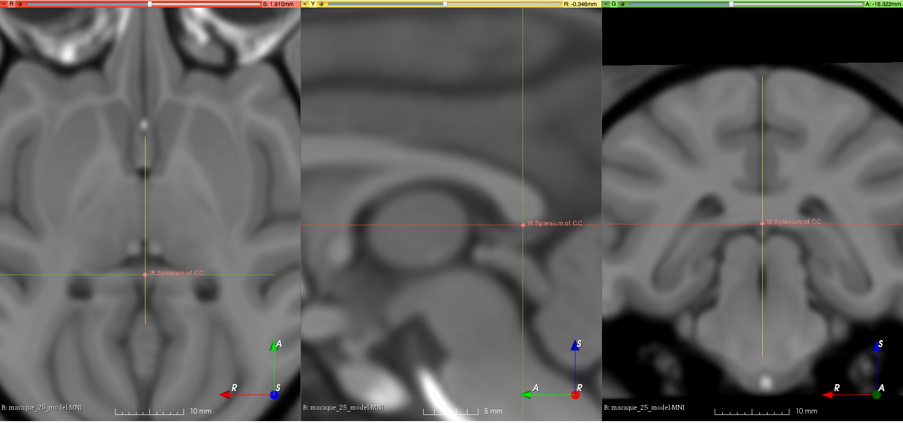

----------------------------

### **21. Right anterolateral temporal horn**

> **Name:** 21  
> **Description:** R AL temporal horn

* Jump to AC and using sagittal view locate the posterior border of AC.
* Navigate laterally using sagittal view and locate anterior-most (and lateral) point of temporal horn.
* Choose a more ventral/inferior point on the coronal view.
* In the coronal view this fiducial should be inferior lateral of the amygdala, while in the sagittal view it is anterior to hippocampus seperated by lateral ventricle.
* Place at the boundary of CSF and white matter

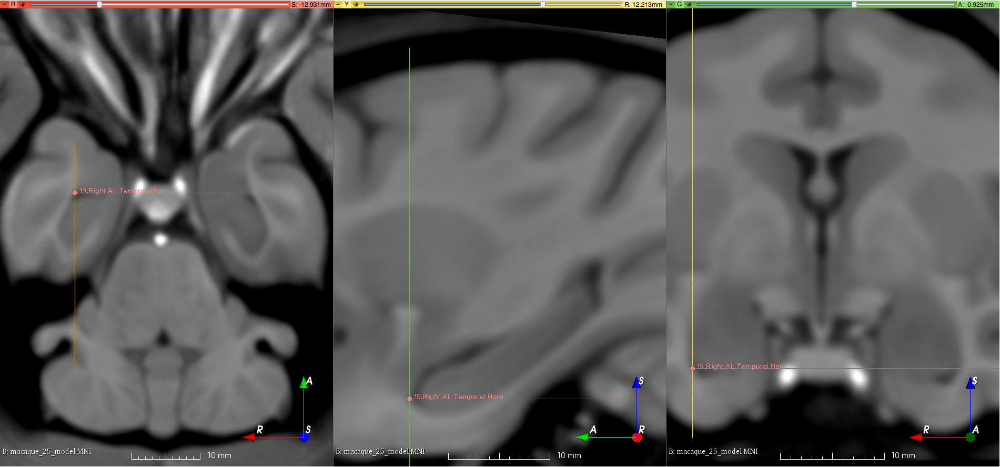

----------------------------

### **22. Left anterolateral temporal horn**

> **Name:** 22  
> **Description:** L AL temporal horn

* As in 21

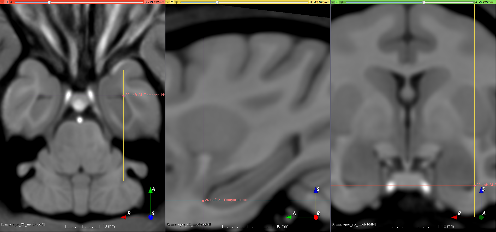

----------------------------

### **23. Right superior AM temporal horn**

> **Name:** 23  
> **Description:** R superior AM temporal horn

* alias: Rhoton's right uncal recess
* Jump to AC, proceeding posterior while monitoring sagittal view until slice intersection is touching posterior of hypothalamus or anterior of the brainstem in sagittal view.
* Proceed lateral while monitoring the coronal view. Place fiducial at the superior hippocampal-amygdalar transition area (HATA). Verify in the axial view.
* NOTE: there is also an inferior anteromedial temporal horn
* Rhoton's uncal recess:
  * "narrow medially projecting space between hippocampal head & ventricular surface of amygdala located lateral to uncal apex")
* Place at the boundary of CSF and brain

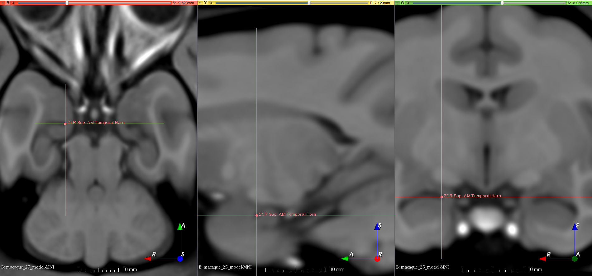

----------------------------

### **24. Left superior AM temporal horn**

> **Name:** 24  
> **Description:** L superior AM temporal horn

* alias: Rhoton's left uncal recess
* As in 23

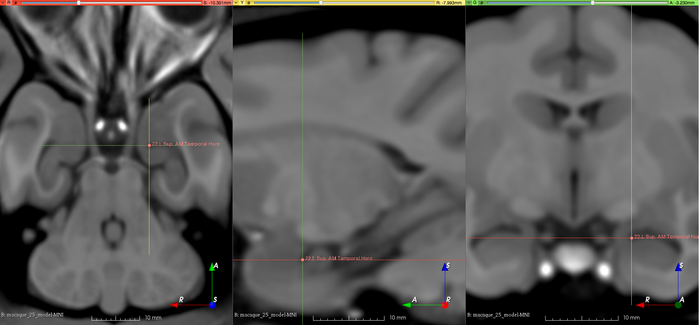

----------------------------

### **25. Right inferior AM temporal horn**

> **Name:** 25  
> **Description:** R inferior AM temporal horn

* Jump to center of AC. Scrolling posterior while monitoring sagittal view, place pointer in the CSF in between AC and the Thalamus. Verify in the axial view that the point is in center of the CSF in that view.
* While monitoring the coronal view, scroll laterally until the sagitall intersection reaches ventricle under the amygdaloid nuclei. The ventricle should appear in the sagittal view as a small opening at this point. 
* Verify that the fiducial is place at the junction of the ventricle-grey matter in the axial view. 

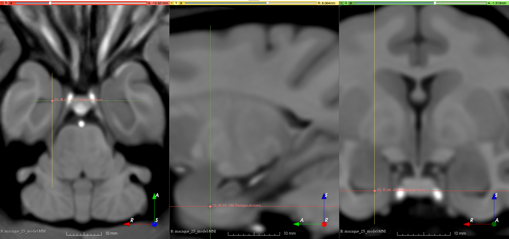

----------------------------

### **26. Left inferior AM temporal horn**

> **Name:** 26  
> **Description:** L inferior AM temporal horn

* Like in 25
* Jump to 22 (left AL temporal horn) and scroll the find the most medial showing of the CSF

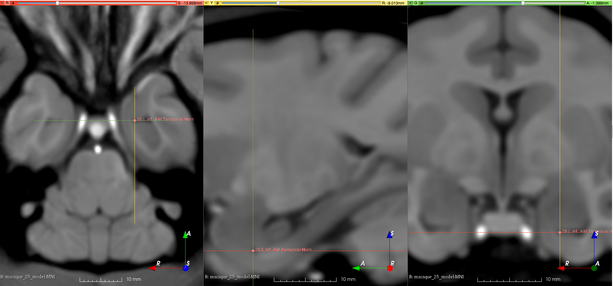

----------------------------

### **27. Right indusium griseum origin**

> **Name:** 27  
> **Description:** R indusium griseum origin

* Defined on sagittal slice at takeoff from posterior hippocampus below splenium
* Jump to AC. In the sagittal view place the slice intersection at the posterior border of splenium in the midline.
* Begin on the sagittal view (make sure the view is on the right side), scroll back and forth to find the point where the tail of the hippocampus begins to become pointed and "takeoff"
* Verify that the fiducial is at the junction of white and grey matter.

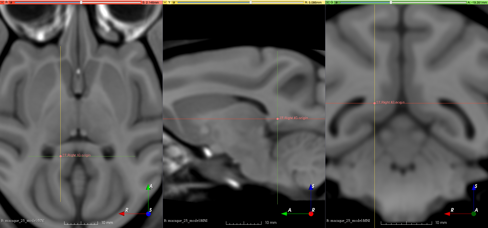

----------------------------

### **28. Left indusium griseum origin**

> **Name:** 28  
> **Description:** L indusium griseum origin

* As in 27

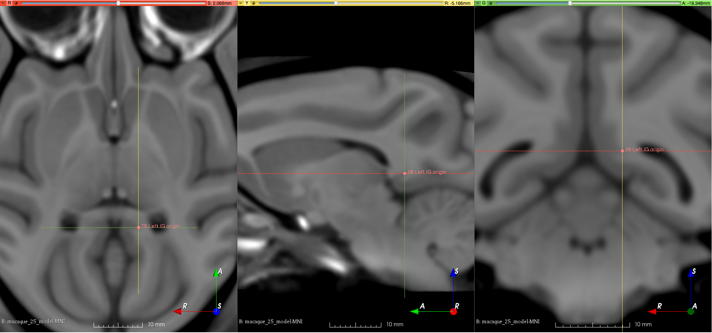

----------------------------

### **29. Right ventral occipital horn**

> **Name:** 29  
> **Description:** R ventral occipital horn

* Defined on ventral/inferior portion of last visible coronal slice with occipital horn
* If it is hard to see on the coronal view then you can make the first placement using the axial view (make sure the view is on the right side of the brain).
* Optimize using other views

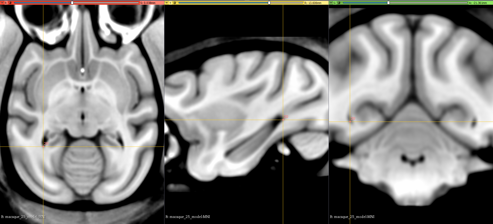

----------------------------

### **30. Left ventral occipital horn**

> **Name:** 30  
> **Description:** L ventral occipital horn

* As in 29

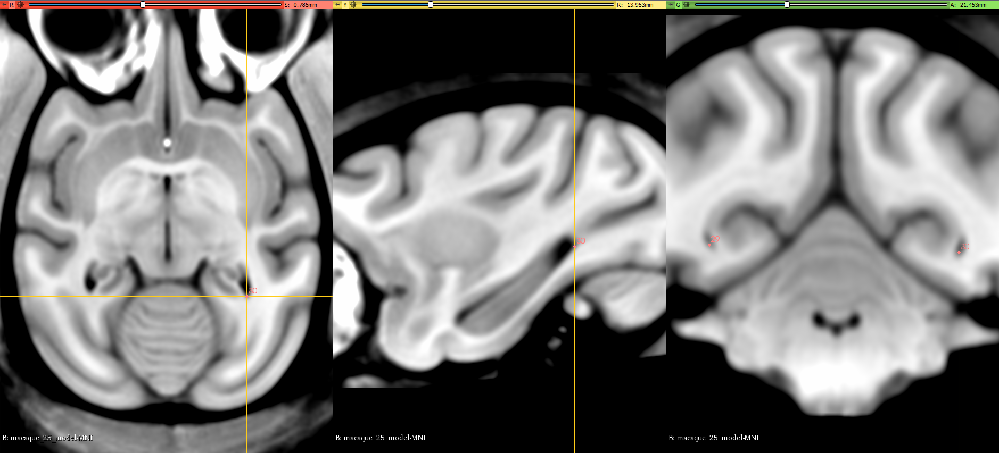

----------------------------

### **31. Right olfactory sulcal fundus**

> **Name:** 31  
> **Description:** R olfactory sulcal fundus

* Jump to Genu of Corpus Collosum (#17). 
* Ensuring the view is on the right side of the brain, scroll back and forth in the sagittal view until you find the most anterior aspect of genu on the right hemisphere. (Typically before Genu becomes continuous with other white matter structures).
* Monitoring the axial view proceed ventral until the fundas is reached. Verify using the coronal view.
* Sulcal fundus = at depth of sulcus and boundary of gray matter-white matter
* Posterior and most superior portion visible on axial slice

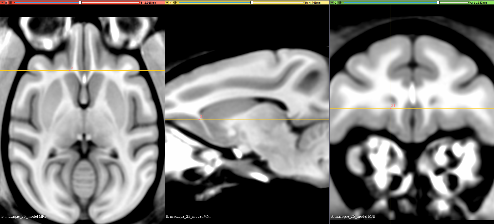

----------------------------

### **32. Left olfactory sulcal fundus**

> **Name:** 32  
> **Description:** L olfactory sulcal fundus

* As in 31

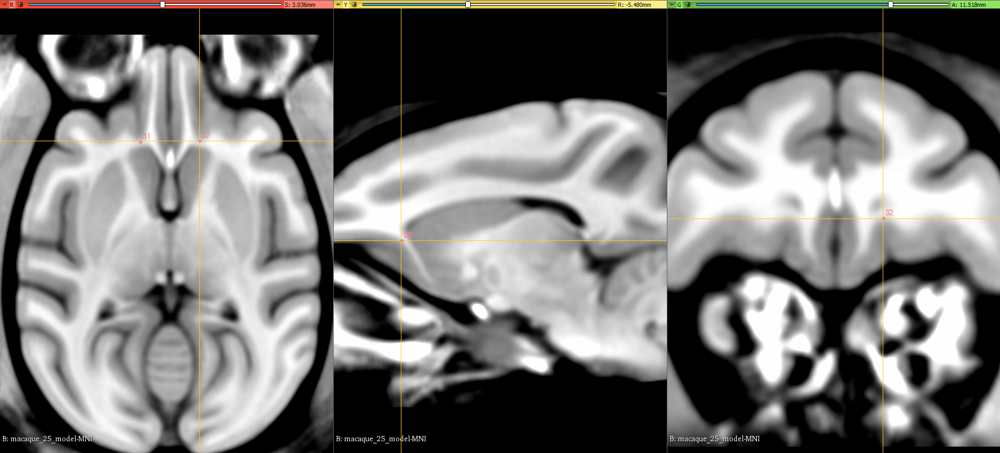

